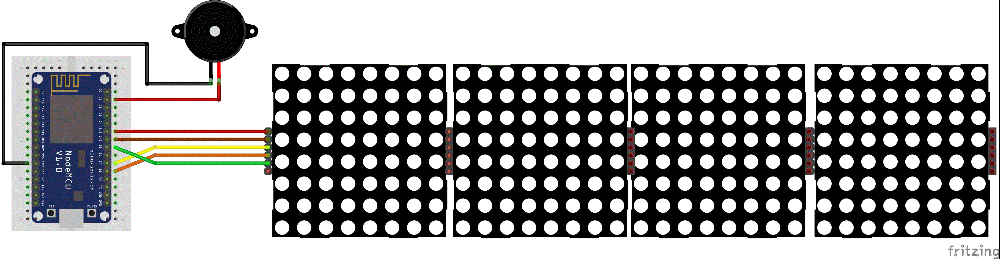
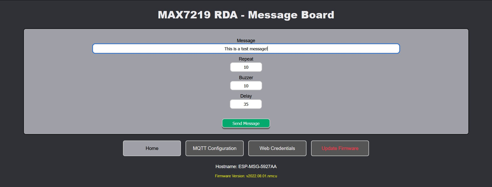
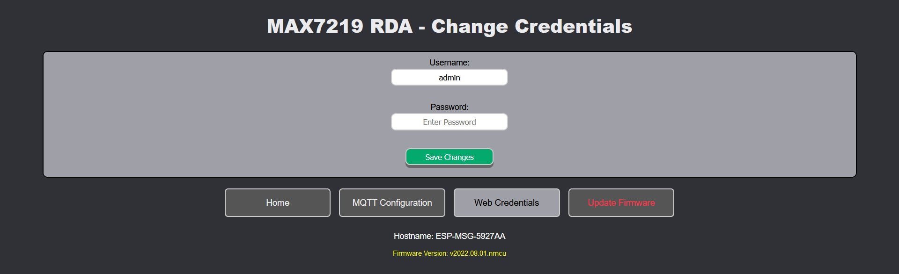
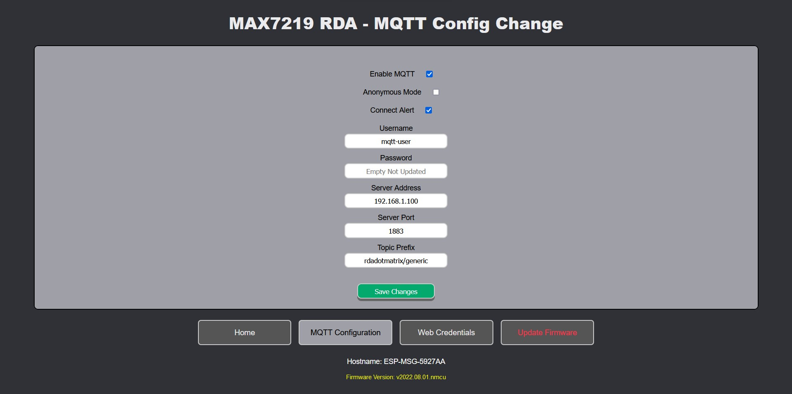
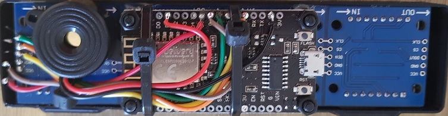
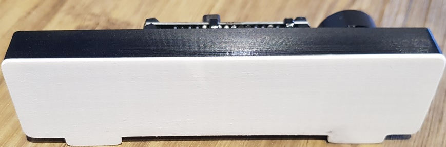
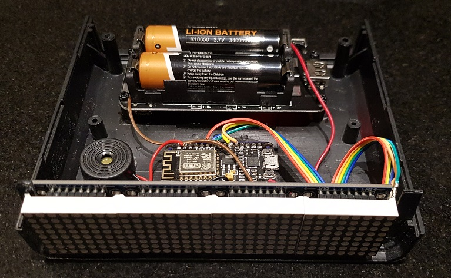
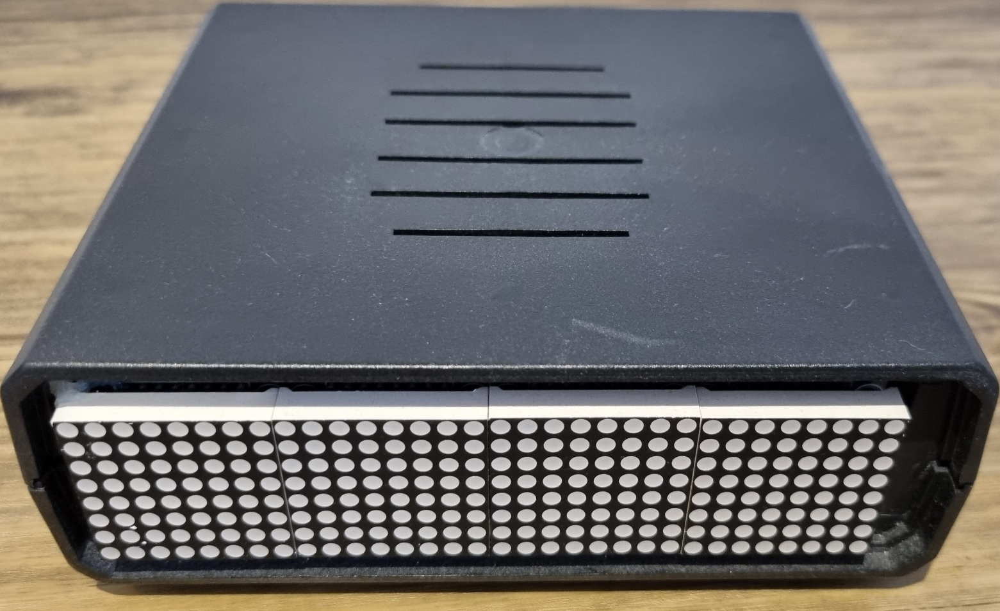
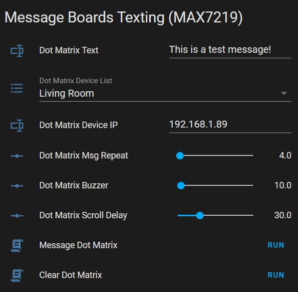

> [!IMPORTANT]  
> ## 🚀 PROJECT RELOCATED & REVAMPED
> 
> **This repository is the legacy Arduino IDE version and is no longer actively maintained.**  
> The project has been completely refactored and moved to a new repository:  
> 👉 **[rdeangel/rda_msg_board](https://github.com/rdeangel/rda_msg_board)**
> 
> ### What's New?
> - **Modernized Toolchain:** Migrated from a monolithic Arduino IDE `.ino` script to a clean, modular **PlatformIO (VS Code)** environment with automated dependency management and multi-environment CI builds.
> - **Exciting New Features:** Added a complete Configuration Export/Import (Backup) system, custom default parameters, an advanced Clock/Timer mode, Sleep Mode scheduling, and Secure MQTT (TLS/SSL) for the ESP32.
> - **Home Assistant Auto-Discovery:** Now supports complete, zero-configuration setup natively via MQTT, alongside the legacy manual REST strategies.
> - **Pre-compiled Releases:** GitHub Actions now automatically provides ready-to-flash binaries for out-of-the-box setups (4x and 8x display module variants).
> 
> ### 100% Backward Compatible 
> Upgrading to the new version requires **no changes** to your existing automations! The new firmware maintains strict drop-in compatibility for existing implementations:
> - **HTTP APIs** (`/arg` and `/api`) use the exact same parameters (`MSG`, `REP`, `DEL`, `BUZ`, `BRI`, etc.).
> - **MQTT Integration** structures, topics, wildcards, and JSON payload formats are completely unchanged.
> - **Web Interface** retains the same conceptual flow while being visually refreshed and optimized.
> - **Hardware** wiring and pin configurations remain fully compatible out-of-the-box.
>
> **[Click here to visit the new repository for the latest code and firmware releases!](https://github.com/rdeangel/rda_msg_board)**

---

# MAX7219 RDA Message Board
This is an ESP8266 based message board and it has been mainly put together to display scrolling messages...
*(continue with the rest of the old README)*


esp8266_max7219_rda_msg_board
============================================================
MAX7219 RDA Message Board

This is an ESP8266 based message board and it has been mainly put togheter to display scrolling messages from remote systems or users such as:
1. Home Assistant, using HTTP or MQTT
2. Linux / Windows using curl
3. A browser URL Link
4. A built-in webgui


"Wifi Setup Mode" on first start or on config wipe
---------------------------------
You'll need to configure your wifi network by connecting to:
```
Wifi SSID: ESP-MSG-ABCDEF  (where ABCDEF are the last 6 digit of mac address)
Wifi Secret: wifi-setup
```
If the browser doesn't open/redirect automatically (it should on recent OSes) browse to http://192.168.4.1 and:
1. Click on "Configure Wifi"
2. Enter your Wifi details
3. Click on "Save"

The board will reboot and should now boot in "Wifi Message Mode".

Connect to your wifi network and look for the IP the board obtained from DHCP (it should be displayed once at the end of the first message upon boot).

I suggest statically assigning an IP on your DHCP so the board always uses the same IP and can be easily accessed. (This is not important for MQTT Messaging but it is for HTTP Web Interface/Messaging).

Please Note: Locally you can also use the hostname in mdns format "ESP-MSG-ABCDEF.local" instead of the IP address.


Default username and password:
---------------------------------
```
username: admin
password: esp8266

```
***You can enable "#define ENABLE_FLASH_BUTTON 1" in 01_Shared.h to use the ESP FLASH button on the ESP8266 or browse to /factoryreset to reset username and password to admin/esp8266, wipe wifi and mqtt configuration and reset the board (the "RST" button only restarts the board with no changes)***


Key Features:
---------------------------------
* HTTP webserver / message board web interface
* Send messages via HTTP using automation systems or scripts ("URI" or "Json api" parameters supported) 
* Send messages via MQTT Server (User Authentication or Anonymous) ("Json" parameters or "Plain" messages supported)
* Support for UTF8 Extended ASCII Characters (see https://www.utf8-chartable.de/)
* Change/Store HTTP credentials
* Change/Store MQTT Config (enable/disable MQTT and connect/disconnect alerting)
* MDNS Supported (browse and send messages via http to mdns name (eg. ESP-MSG-ABCDEF.local) or to selected IP address (future improvement ability to change hostname)
* WifiManager provides a web portal to configure wifi SSID and Password when one hasn't been previously configured
* Press ESP8266 FLASH button (or browse to /factoryreset) to wipe Wifi SSID Config, HTTP credentials and MQTT Setting.


UTF8 Extended ASCII Characters
---------------------------------
Character you can display as arguments
```
!"$'()*,-./0123456789:<=>?@ABCDEFGHIJKLMNOPQRSTUVWXYZ[\]^_`abcdefghijklmnopqrstuvwxyz{|}~¡¢£€¤¥¦§¨©ª«¬­®¯°±²³´µ¶·¸¹º»¼½¾¿ÀÁÂÃÄÅÆÇÈÉÊËÌÍÎÏÐÑÒÓÔÕÖ×ØÙÚÛÜÝÞßàáâãäåæçèéêëìíîïðñòóôõö÷øùúûüýþÿ
```
Characters that can't always be send as part of a message (with exception of nodered where all characters can be used by escaping certain characters):
``` 
#%&+;
```
Please Note: From the node-red import file node_red_flow.json (it uses MQTT) you'll find a sub-group with a function where I escape characters like backslash or double-quotes which can stop a message from displaying at all. This is particularly useful if working with RSS feeds in node-red.

Board Wiring
---------------------------------


Specify number of LED modules used (change the below value in 01_Shared.h to 8, 12, etc..): 
```
#define MAX_DEVICES 4
```

MAX7219 Pinout Code Definition (change pin below in 01_Shared.h if you use different pins):
```
#define CLK_PIN D5 // or SCK
#define DATA_PIN D7 // or MOSI
#define CS_PIN D8
```

Buzzer Pinout Code Definition (change pin below in 01_Shared.h if you use different pins):
```
#define BUZZER D1
```

Web Interface
---------------------------------







Project Case Example 1
---------------------------------





Project Case Example 2
---------------------------------






URL Argument / HTTP-API and MQTT JSON Parameters:
---------------------------------
```
MSG -> Message to display on dot matrix
REP -> Number of times the message scrolls horizontally across the dot matrix
BUZ -> Number of times the buzzer makes a sound (chirps) in repeated succession
DEL -> Delay in millisecond for each scrolling step (speed of scrolling message)
BRI -> Brightness of LED display (values ranging from 0 lowest to 15 highest)
ASC -> ASCII coversion to enable correct translation of UTF8 Extended ASCII Characters
```
From version v2022.08.14, to send a message, you can send only some parameters, the other will take from the device default (currently hardcoded).

Please Note: The MSG parameter needs to be present to send a message, omitting the MSG parameter or sending no parameters will result in display termination of current message (end of message scrolling).

A couple of examples for sending JSON via MQTT or HTTP api.

Example 1:
```
{"MSG":"Test"}
```
this is equivalent to sending a message to MQTT to a non /json ending topic, every other parameter will use default parameters values currently hardcoded in 01_Shared.h.
The following hardcoded defaults that will be use are:
REP 10
BUZ 10
DEL 35
BRI 7
ASC 1

Example 2:
```
{
  "MSG":"Test",
  "BRI":"0"
}
```
This will send a Test message and display it at the lowest possible brightness.
The following hardcoded default parameters will be use:
REP 10
BUZ 10
DEL 35
ASC 1


MQTT Topic Publishing/Subscribing
---------------------------------
If you enter the following Topic Prefix "rdadotmatrix/generic" as part of your MQTT config, the following log message can be seen from console if "#define DEBUG 1" is defined:
```
Publishing to topic hostname/status: connected (this currently has no use)
Subscribe to topic: root_topic
Subscribe to topic: root_topic/json 
Subscribe to topic: root_topic/topic
Subscribe to topic: root_topic/topic/json
Subscribe to topic: hostname
Subscribe to topic: hostname/json
```
Example:
```
Restoring MQTT connection...
ESP-MSG-ABCDEF connected to MQTT Server: 192.168.1.100:1883
Publishing to topic ESP-MSG-ABCDEF/status: connected
Subscribe to topic: rdadotmatrix
Subscribe to topic: rdadotmatrix/json
Subscribe to topic: rdadotmatrix/generic
Subscribe to topic: rdadotmatrix/generic/json
Subscribe to topic: ESP-MSG-ABCDEF
Subscribe to topic: ESP-MSG-ABCDEF/json
```

Please Note:
1. Any message published to a subscribed topic ending with /json will require a json message with any number of parameters passed above (MSG is mandatory to display a message).
2. Any message published to a subscribed topic NOT ending with /json will take a message as a plain string with no additional parameter. (hard coded default parameters will be used, in future configurable I hope).

it is also possible to use # for wildcard (at the end of a topic only), and + as part of a topic to indicate part of a topic path as a wildcard.

for example if you configure topic prefix as "rdadotmatrix/generic/#" you would get the following topic subscriptions:
```
Restoring MQTT connection...
ESP-MSG-ABCDEF connected to MQTT Server: 192.168.1.100:1883
Publishing to topic ESP-MSG-ABCDEF/status: connected
Subscribe to topic: rdadotmatrix
Subscribe to topic: rdadotmatrix/json
Subscribe to topic: rdadotmatrix/generic/#
Subscribe to topic: ESP-MSG-ABCDEF
Subscribe to topic: ESP-MSG-ABCDEF/json
```
Please Note: with a wildcard "#" at the end of the topic you would still be able to publish messages with parameters to a topic such as rdadotmatrix/generic/whatever/json or rdadotmatrix/generic/whatever/anotherlevel/json or any other longer multilevel topic.


Send Messages using curl from cli:
---------------------------------
```
curl --user admin:esp8266 -X POST http://192.168.1.89/api -H 'Content-Type: application/json' -d '{"MSG":"This is a test message","REP":"4","BUZ":"10","DEL":"30","BRI":"7","ASC":"1"}'
```

```
curl --user admin:esp8266 -X GET -G -s -o /dev/null 'http://192.168.1.89/arg' --data-urlencode "MSG=This is a test message" --data-urlencode "REP=10" --data-urlencode "BUZ=10" --data-urlencode "DEL=35" --data-urlencode "BRI=7" --data-urlencode "ASC=1"
```

```
curl --user admin:esp8266 -X GET -G -s -o /dev/null 'http://192.168.1.89/arg?MSG=This+is+a+test+message%21&REP=10&BUZ=10&DEL=35&BRI=7&ASC=1'
```

You can also use this URL encoded link fromatting to send messages from a browser:
```
http://192.168.1.89/arg?MSG=This+is+a+test+message%21&REP=10&BUZ=10&DEL=35&BRI=7&ASC=1
```
see https://meyerweb.com/eric/tools/dencoder/ for URL encode and decode 


Send Messages from Home assistant Dashboard Card:
---------------------------------
***Please Note: you'll have to use the base64 encoded as the username:password to send messages via HTTP***

you should configure the following in your secrets.yaml file if you are using default credentials:

```
dot_matrix_secret_header: "Basic YWRtaW46ZXNwODI2Ng=="

````
for any other you can calculate your own for example enter admin:esp8266 in http://n-cg.net/base64.htm and click encode to obtain YWRtaW46ZXNwODI2Ng==


You can for example define your own home assistant dashboard/lovelace interface to send test to the message board:



Follow these steps:

1. Create the relevant custom entities from home assistant gui and enter this in your lovelace interface tab for example:

```
type: entities
entities:
  - entity: input_text.dot_matrix_text
  - entity: input_select.dot_matrix_device_list
  - entity: input_text.dot_matrix_ip
  - entity: input_select.rda_dot_matrix_mqtt_topic
  - entity: input_number.dot_matrix_msg_repeat
  - entity: input_number.dot_matrix_buzzer
  - entity: input_number.dot_matrix_scroll_delay
  - entity: input_number.dot_matrix_brightness
  - entity: script.message_dot_matrix_http
  - entity: script.clear_dot_matrix_http
  - entity: script.message_dot_matrix_mqtt
  - entity: script.clear_dot_matrix_mqtt
title: Message Boards Texting (MAX7219)
```


2. Enter this in configuration.yaml:
```
rest_command:
  message_dot_matrix_arg_http:
    url: "http://{{ states('input_text.dot_matrix_ip') }}/api"
    method: POST
    headers:
      authorization: !secret dot_matrix_secret_header
      content-type: "application/json"
    payload: "{MSG:'{{ states('input_text.dot_matrix_text') }}',REP:{{ states('input_number.dot_matrix_msg_repeat') }},BUZ:{{ states('input_number.dot_matrix_buzzer') }},DEL:{{ states('input_number.dot_matrix_scroll_delay') }},BRI:{{ states('input_number.dot_matrix_brightness') }},ASC:1}"
  clear_dot_matrix_arg_http:
    url: "http://{{ states('input_text.dot_matrix_ip') }}/arg"
    method: GET
    headers:
      authorization: !secret dot_matrix_secret_header
```


3. if you have multiple message boards you can create an automations to switch IP address from the input_select list entity:

automation.change_value_of_dot_matrix_input_text
```
alias: Change Value of Dot Matrix Input Text
description: ''
trigger:
  - platform: state
    entity_id: input_select.dot_matrix_device_list
condition: []
action:
  - service: input_text.set_value
    target:
      entity_id: input_text.dot_matrix_ip
    data_template:
      value: >
        
          192.168.1.88
        
          192.168.1.89
        
mode: single 
```


4. Also create the following home assistant scripts:

script.message_dot_matrix:
```
sequence:
  - service: rest_command.message_dot_matrix_arg_http
    data: {}
mode: single
alias: Message Dot Matrix
```

script.clear_dot_matrix:
```
sequence:
  - service: rest_command.clear_dot_matrix_arg_http
    data: {}
mode: single
alias: Clear Dot Matrix
```

5. For MQTT send message from home assistant, you can create the following script:

script.message_dot_matrix_mqtt
```
alias: Message Dot Matrix MQTT
sequence:
  - service: mqtt.publish
    data:
      topic: '{{ states(''input_select.rda_dot_matrix_mqtt_topic'') }}'
      payload: |-
        { MSG: "{{ states('input_text.dot_matrix_text') }}",
          REP: "{{ states('input_number.dot_matrix_msg_repeat') }}",
          BUZ: "{{ states('input_number.dot_matrix_buzzer') }}", 
          DEL: "{{ states('input_number.dot_matrix_scroll_delay') }}",
          BRI: "{{ states('input_number.dot_matrix_brightness') }}",
          ASC: '1' 
        }
mode: single
```

6. To clear message repeats (stop displaying current message):

script.clear_dot_matrix_mqtt
```
alias: Clear Dot Matrix MQTT
sequence:
  - service: mqtt.publish
    data:
      topic: '{{ states(''input_select.rda_dot_matrix_mqtt_topic'') }}'
      payload: |-
        { MSG: ""
        }
mode: single
```


Home Assistant Feedreader
---------------------------------

You can also use home assistant RSS Feeds to send news text to the message board or even better NodeRed (which I prefer for this, included in the node-red import file node_red_flow.json)

1. enter some rss feeds like the below for example in your home assistant configuration.yaml
```
feedreader:
  urls:
    - http://feeds.bbci.co.uk/news/world/rss.xml
    - http://feeds.bbci.co.uk/news/rss.xml
    - http://feeds.bbci.co.uk/news/health/rss.xml
    - http://feeds.bbci.co.uk/news/technology/rss.xml
    - http://feeds.bbci.co.uk/news/science_and_environment/rss.xml
  scan_interval:
    minutes: 5
  max_entries: 5
```

and an http call with arguments or json api again in configuration.yaml

```
rest_command:
  ### some examples althought we'll use the first one for RSS feed automation below
  feed_to_dot_matrix_api_http:
    url: "http://{{ipaddress}}/api"
    method: POST
    headers:
      authorization: !secret dot_matrix_secret_header
      content-type: "application/json"
    payload: "{MSG:'{{msg}}',REP:{{rep}},BUZ:{{buz}},DEL:{{del}},ASC:1}"
  feed_to_dot_matrix_arg_http:
    url: "http://{{ipaddress}}/arg?MSG={{msg}}&REP={{rep}}&BUZ={{buz}}&DEL={{del}}&BRI={{bri}}&ASC=1"
    method: GET
    headers:
      authorization: !secret dot_matrix_secret_header
```

Or you can use MQTT.

Please Note: it is important you use /json at the end of the topic. 
Topics ending with /json are automatically subscribed regardless of the configure topic prefix.

Configure the following script:
```
alias: Feed To Dot Matrix MQTT
sequence:
- service: mqtt.publish
  data:
	topic: 'rdadotmatrix/json'
	payload: |-
		{ MSG: "{{msg}}",
		  REP: "{{rep}}",
		  BUZ: "{{buz}}", 
		  DEL: "{{del}}",
      DEL: "{{bri}}",
		  ASC: '1' 
		}
mode: single
```


2. Then configure an automation as follows if you have for example 2 different message boards and you want to send to both:
```
alias: Feed Reader To Matrix via HTTP
description: ''
trigger:
  - platform: event
    event_type: feedreader
condition: []
action:
  - service: rest_command.feed_to_dot_matrix_api_http
    data:
      ipaddress: 192.168.1.88
      msg: >-
        News Feed: {{ trigger.event.data.title }}.... {{
        trigger.event.data.summary }}
      rep: 10
      buz: 10
      del: 35
      bri: 7
  - service: rest_command.feed_to_dot_matrix_api_http
    data:
      ipaddress: 192.168.1.89
      msg: >-
        News Feed: {{ trigger.event.data.title }}.... {{
        trigger.event.data.summary }}
      rep: 10
      buz: 10
      del: 35
      bri: 7
mode: single
```

or if you are using MQTT (not tested but should work)

```
alias: Feed Reader To Matrix via MQTT
description: ''
trigger:
  - platform: event
    event_type: feedreader
condition: []
action:
  - service: script.feed_to_dot_matrix_mqtt
    data:
      msg: >-
        News Feed: {{ trigger.event.data.title }}.... {{
        trigger.event.data.summary }}
      rep: 10
      buz: 10
      del: 35
      bri: 7
mode: single
```


Send messages from NodeRed
---------------------------------
Import file node_red_flow.json into nodered.

Please Note: There are several subflows (look inside). 

Specific npm_packages will need to be installed in NodeRed to use this import and I believe these are all you need to add (hope I didn't miss any): 
```
npm_packages:
  - node-red-contrib-simple-message-queue
  - node-red-node-feedparser
```

